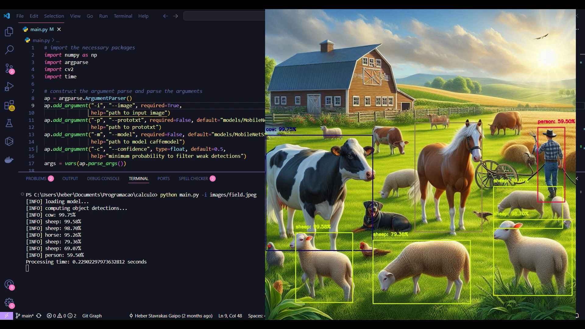
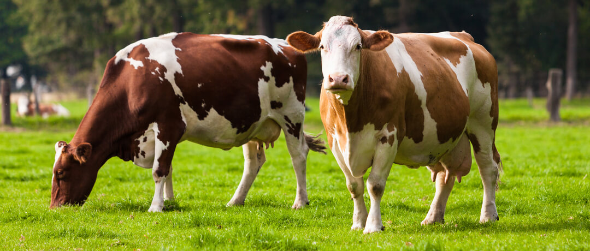
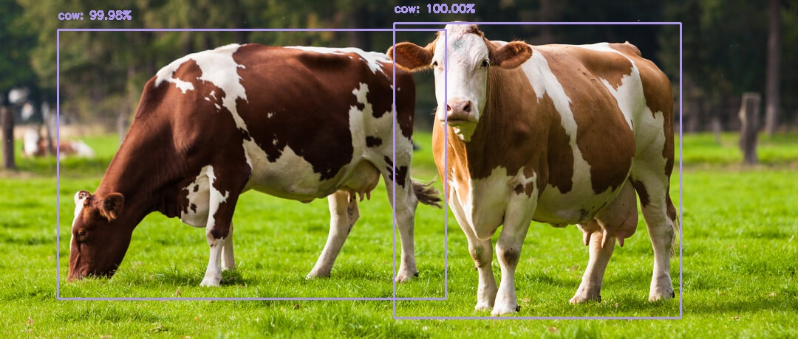
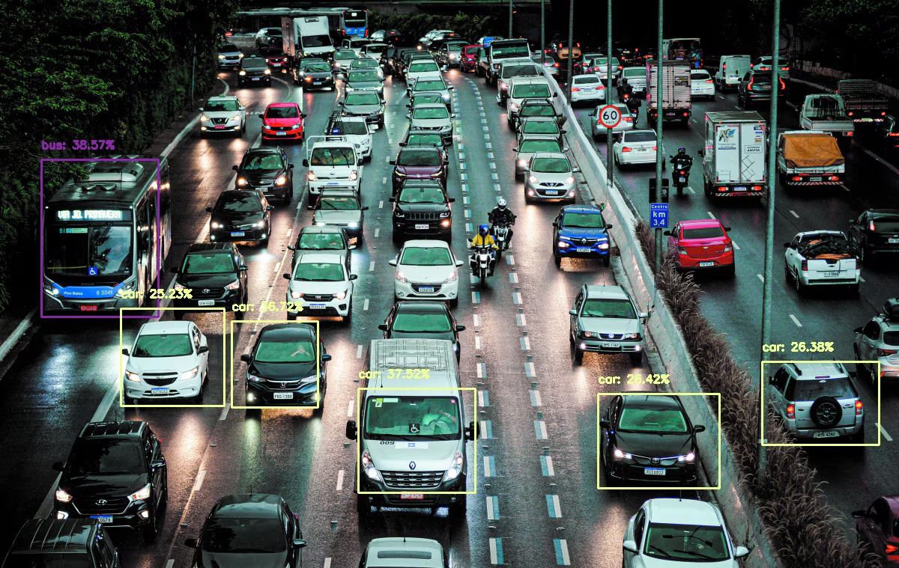
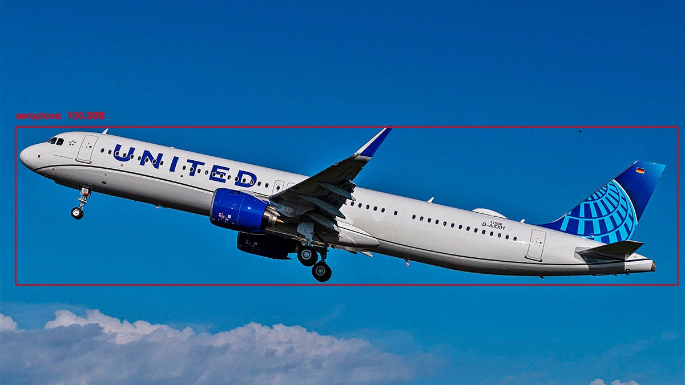

# Detecção de Objetos com Python e um Toque de Cálculo! 🚀

Já imaginou como seu computador consegue "enxergar" objetos em imagens? 🤔 Este projeto mergulha no mundo fascinante da Visão Computacional e mostra como o Cálculo está por trás dessa mágica! ✨

## Sobre o Projeto

Este projeto foi desenvolvido como um trabalho para a disciplina de Cálculo 2, com o objetivo de explorar a aplicação do cálculo na detecção de objetos em imagens. Utilizamos a poderosa arquitetura MobileNet SSD e a biblioteca OpenCV em Python para criar um detector de objetos eficiente.

<a href="https://youtu.be/bzvqNjl6_2U" aLign="center">
  
👆 Clique para ver como executar o modelo

  
</a>

## Como Funciona?

Em termos simples, a mágica acontece assim:

1. **Carregamos um modelo pré-treinado:** A MobileNet SSD já vem com um conhecimento prévio sobre diversos tipos de objetos, graças ao seu treinamento em um enorme conjunto de dados.
2. **Pré-processamos a imagem:** Ajustamos a imagem de entrada para que o modelo possa entendê-la melhor (tipo dar uma ajeitadinha antes da festa 🎉).
3. **Detecção na prática:** A MobileNet SSD analisa a imagem e identifica os objetos presentes, desenhando caixas delimitadoras e indicando o tipo de objeto detectado.
4. **Cálculo por trás das cortinas:** As redes neurais, como a MobileNet SSD, utilizam conceitos de cálculo, como convoluções (integrais discretas!), ativações não-lineares (funções deriváveis!) e backpropagation (derivadas parciais e otimização!), para aprender e detectar objetos. Mesmo que não vejamos essas fórmulas diretamente no código, elas são a base de tudo!

## Como Rodar o Projeto

1. **Clone o repositório:** `git clone https://github.com/Heber-Stavrakas-Gaipo/object_detection_with_MobileNetSSD.git`
2. **Instale as dependências:** `pip install -r requirements.txt`
3. **Execute o script:** `python main.py -i <caminho_para_imagem>` (substitua `<caminho_para_imagem>` pelo caminho da imagem que você quer analisar)

## Exemplos

Dá uma olhada nos resultados que conseguimos! 👇

## Tecnologias Utilizadas

- **Python:** A linguagem de programação que usamos para dar vida ao projeto. 🐍
- **OpenCV:** Uma biblioteca incrível para visão computacional. 👁️
- **MobileNet SSD:** Uma arquitetura de rede neural eficiente para detecção de objetos em tempo real. 💨
- **Cálculo (claro! 😉):** A base matemática que torna tudo isso possível. 📐

## Contribuições

Contribuições são sempre bem-vindas! Sinta-se à vontade para abrir issues ou enviar pull requests. 🙌

## Licença

Este projeto está licenciado sob a licença MIT. Fique à vontade para usar, modificar e compartilhar!

## Contato

Se tiver alguma dúvida ou quiser bater um papo sobre o projeto, pode me encontrar aqui:

  
  
  

